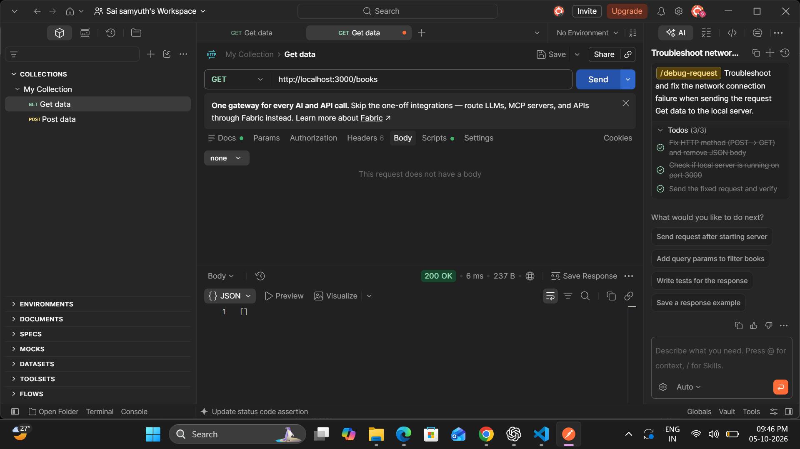
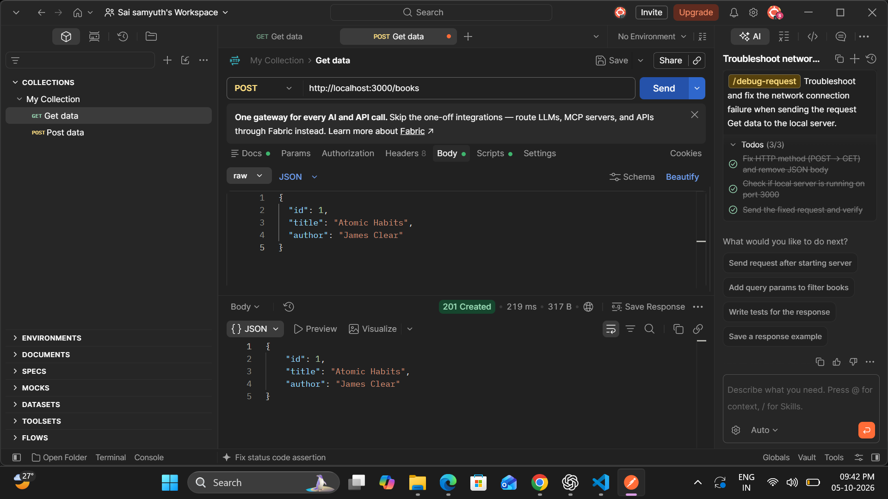
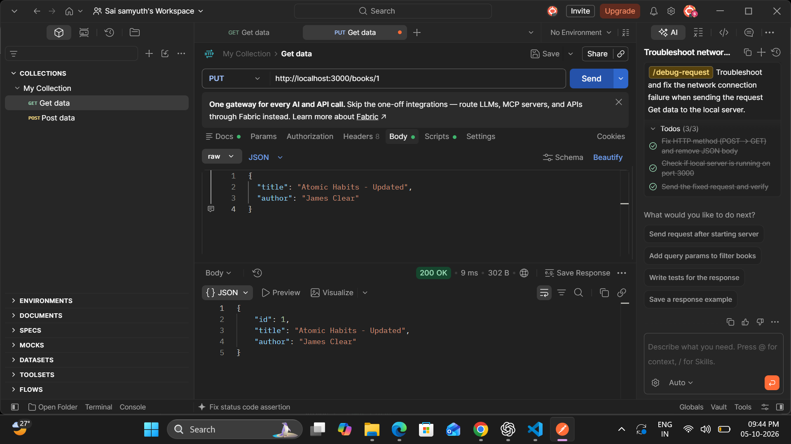
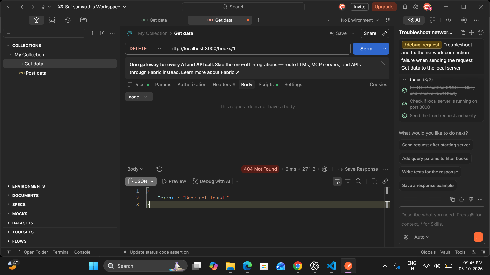

# Books REST API

A simple REST API built using Node.js and Express.js to manage a list of books.

## Task

Create a REST API to manage a list of books using Node.js and Express.

## Features

- Get all books
- Add a new book
- Update a book
- Delete a book
- JSON request and response handling
- RESTful API endpoints
- In-memory book storage

## Technologies Used

- Node.js
- Express.js
- JavaScript
- Postman
- GitHub

## API Endpoints

| Method | Endpoint | Description |
|--------|----------|-------------|
| GET | `/books` | Get all books |
| POST | `/books` | Add a new book |
| PUT | `/books/:id` | Update a book |
| DELETE | `/books/:id` | Delete a book |

## Example Book

```json
{
  "id": 1,
  "title": "Atomic Habits",
  "author": "James Clear"
}

## API Testing Evidence

The REST API was tested using Postman for all CRUD operations.

### GET - Read Books



### POST - Add Book



### PUT - Update Book



### DELETE - Delete Book

